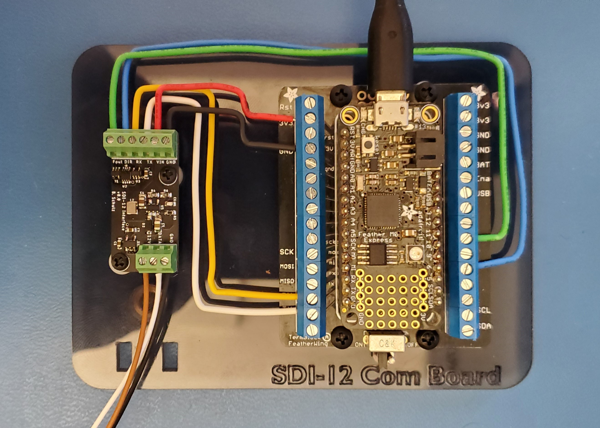
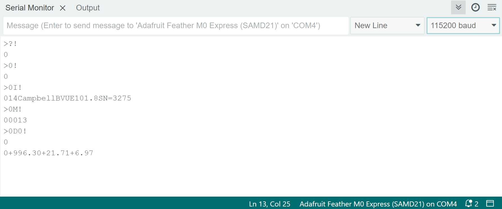

# SDI12_Command
Arduino code for simple SDI-12 interface using a custom [SDI12 module](https://github.com/bschulz1701/Break44/tree/master/SDI12_Interface) 

# Repo Roadmap
#### [Documentation](Documentation/)

General document and image storage for repo and README

<!-- #### [Hardware](Hardware/)

Current board files (Eagle), and other electrical design documents -->

#### [Mechanical](Mechanical/)

Mechanical design files and assembly documents
<!-- 
#### [Production](Production/)

Contains the various Gerber and pick and place files required to have the Printed Circuit Boards (PCBs) manufactured or populated  -->

#### [Firmware](Firmware/)

Contains the firmware used on board the device along with any documentation required for interfacing 

<!-- #### [Software](Software/)

The software associated with the piece of hardware, this is usually diagnostic software used for verifying or investigating the hardware -->

<!-- #### [Testing](Testing/)

Scripts and results from the testing process and development process. Contains more detailed information about documented issues among other testing. --> 

# Setup:

> [!CAUTION]
> Make sure unit is disconnected from USB power before wiring in sensor and double check all sensor pinout before re-connecting USB power. Failure to do so could result in catastrophic sensor damage!

1. Disconnect USB - if not already
2. Wire sensor in to SDI12 connections (12V, GND, DATA on small PCB)
3. Double check sensor connections 
4. Connect USB to computer 
5. Open Arduino IDE - or other preferred serial monitor 
6. Select board and port appropriately 
7. Open serial monitor - Make sure Line Ending is set to **New Line** or **Carriage Return** and Baud is set to **115200**
8. Type commands (as defined by [SDI-12 Spec](https://www.sdi-12.org/current_specification/SDI-12_version-1_4-Jan-10-2019.pdf) - E.g. `?!`, `0I!`, etc) into the Message box
9. Press Enter to send command, you should see the command echoed back (E.g. if `?!` is sent, `>?!` should be printed in output), followed by a new line with the sensor response

> [!TIP]
> If having trouble identifying which port is the correct one, make note of the ports listed, then disconnect the Feather board and check the list again for which one is no longer there

# Assembly:

## Parts:

Item | Model | Vendor |
---- | ----- | ------ |
Feather Adapter | Assembled Terminal Block Breakout | [Adafruit](https://www.adafruit.com/product/2926), [Digikey](https://www.digikey.com/en/products/detail/adafruit-industries-llc/2926/5959339) |
Feather Board[^1] | Adafruit Feather M0 Express | [Adafruit](https://www.adafruit.com/product/3403) |
SDI-12 Interface Board | SDI12_Interface v0.0 | [Custom](https://github.com/bschulz1701/Break44/tree/master/SDI12_Interface) |

[^1]: Should work with any Feather board with multiple `Serial` ports - such as [Feather M0 series](https://www.adafruit.com/search?q=feather+m0) and [Feather 32u4 series](https://www.adafruit.com/search?q=feather+32u4) 

## Wiring:

### System:

The Feather board is wired to the SDI-12 Interface Module to provide power and communication 

Connection is as follows:

Feather Pin | SDI12 Module Pin |
----------- | ---------------- |
3v3 | VIN |
GND | GND
RX | RX | 
TX | TX |
11[^*] | Fout |
9[^*] | DIR |

[^*]: These pins are configurable in the device firmware, any digital IO pin may be used 

### Sensor:

The sensor is wired directly into the SDI12 Module (see [example image](Documentation/images/BoardPhoto.jpg)). 

Pinout is as follows:

Sensor[^2] | SDI12 Module |
------ | ------------ |
Serial Data Line | DATA |
Ground Line | GND |
12-volt Line | 12V |

[^2]: Names defined in [SDI-12 Spec](https://www.sdi-12.org/current_specification/SDI-12_version-1_4-Jan-10-2019.pdf)

## Firmware:
The Feather board is running a simple piece of Arduino code. To get the device working, this code needs to be flashed to the Feather board. 

1. Install [Arduino IDE](https://www.arduino.cc/en/software) - if needed
2. Setup Arduino IDE to work with Feather M0 - [Adafruit Guide](https://learn.adafruit.com/adafruit-feather-m0-express-designed-for-circuit-python-circuitpython/arduino-ide-setup)
3. Open [code](Firmware/CommandLine/CommandLine.ino) in the Arduino IDE
4. Connect Feather via USB
5. Select board and port from dropdown - [Adafruit Guide](https://learn.adafruit.com/adafruit-feather-m0-express-designed-for-circuit-python-circuitpython/using-with-arduino-ide)
6. Upload to Feather board - Arrow button in upper left corner

